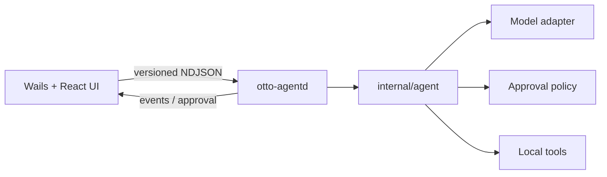

# Otto

Otto 是一个 Go-first 的本地 Agent 产品：移动端负责对话与远程控制，桌面端作为可信执行节点完成实际工作。

当前仓库从零开始采用 Wails v3 构建桌面端。第一阶段先打通一条完整链路：



## 技术基线

- Go `1.25.0`
- Wails `v3.0.0-alpha2.119`
- React 18 + TypeScript + Vite
- Protocol v1（NDJSON，桌面壳与 Agent Runtime 解耦）

Wails v3 目前仍是 alpha，因此 Go 模块、CLI 和前端 Runtime 都固定在同一个版本，升级时应三者一起验证。

## 目录

```text
.
├── cmd/otto-agentd       # 独立的本地 Agent Runtime 进程
├── internal/agent        # 私有、与传输无关的 Agent Core
├── internal/agentd       # NDJSON Runtime Server
├── internal/desktop      # Wails 到 Runtime 的进程适配层
├── internal/fake         # 当前可运行的确定性 Model / Tool / Policy
├── protocol              # 跨进程版本化协议
├── frontend              # Wails React 桌面界面
└── build                 # Wails 各平台构建配置
```

`internal/agent` 不依赖 Wails，也不依赖具体模型 SDK。后续接入 OpenAI、Claude 或自建模型时，通过 `Model` 接口扩展；本地能力通过 `Tool` 扩展；审批边界通过 `Policy` 控制。

## 本地开发

```bash
go install github.com/wailsapp/wails/v3/cmd/wails3@v3.0.0-alpha2.119
cd frontend && npm install && cd ..
wails3 task dev
```

构建桌面应用：

```bash
wails3 task build
```

根构建任务会先生成 `bin/otto-agentd`，再构建 Wails 主进程；macOS app bundle 会把两者放在同一 `Contents/MacOS` 目录。

运行验证：

```bash
go test ./...
go vet ./...
cd frontend && npm run build
```

## 下一阶段

当前完成的是桌面执行节点和本地闭环。移动端不会复制 Agent Core，而是作为轻客户端，通过后续的 Relay / Pairing 层向桌面节点发指令、接收事件并完成高风险操作审批。
